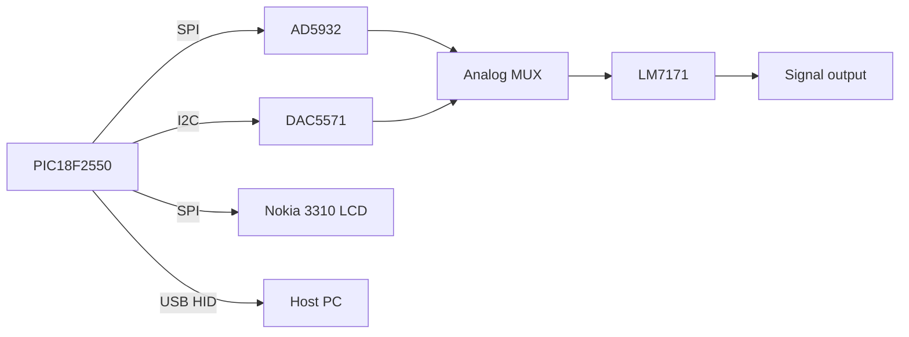

# SignalFactory — PIC18F2550 Firmware

[](LICENSE)

Firmware for the **SignalFactory SF 267017-USB** signal generator, developed by **Group 6 (G6)** for **EE329 Product Design & Management**. The device generates programmable waveforms via an **AD5932** DDS, conditions the output with an **LM7171** amplifier, and is controlled by a **PIC18F2550** with a **Nokia 3310** (PCD8544) display and USB HID host interface.

## Schematic

Hardware design drawings are included in this repository:

| Document | Location | Description |
|----------|----------|-------------|
| **SCHEMATIC.pdf** | [`SCHEMATIC.pdf`](SCHEMATIC.pdf) | Full circuit schematic |


## Key Components

| Role | Part | Description | Product / datasheet |
|------|------|-------------|---------------------|
| **Microcontroller** | [PIC18F2550](https://www.microchip.com/en-us/product/pic18f2550) | 8-bit USB MCU, 32 KB Flash, 48 MHz | [Microchip product page](https://www.microchip.com/en-us/product/pic18f2550) · [Datasheet (DS39632)](https://ww1.microchip.com/downloads/en/DeviceDoc/39632C.pdf) |
| **DDS** | [AD5932](https://www.analog.com/en/products/ad5932.html) | Programmable waveform / frequency-scan generator (sine, triangle, square) | [Analog Devices product page](https://www.analog.com/en/products/ad5932.html) · [Datasheet](https://www.analog.com/media/en/technical-documentation/data-sheets/AD5932.pdf) |
| **Amplifier** | [LM7171](https://www.ti.com/product/LM7171) | Very high-speed voltage-feedback op amp (output buffering / gain) | [TI product page](https://www.ti.com/product/LM7171) · [Datasheet](https://www.ti.com/lit/ds/symlink/lm7171.pdf) |
| **DAC** | [DAC5571](https://www.ti.com/product/DAC5571) | 8-bit buffered voltage-output DAC, I2C | [TI product page](https://www.ti.com/product/DAC5571) · [Datasheet](https://www.ti.com/lit/ds/symlink/dac5571.pdf) |
| **Display** | Nokia 3310 LCD | 84×48 monochrome matrix, **PCD8544** controller | [PCD8544 datasheet (NXP)](https://www.nxp.com/docs/en/data-sheet/PCD8544.pdf) |

Additional on-board blocks (see schematic): analog output multiplexer, 4×4 keypad, and USB interface.

## Overview

This project is the embedded control software for a benchtop signal generator. A PIC18F2550 microcontroller drives:

- An **AD5932** DDS for frequency and waveform generation (sine, triangle, square)
- A **DAC5571** I2C DAC for custom and arbitrary waveforms
- An **LM7171** amplifier stage on the analog output path
- An **analog output multiplexer** to route DDS, DAC to the output
- A **Nokia 3310** 84×48 LCD (PCD8544) for the user interface
- A **4×4 matrix keypad** for menu navigation and numeric entry
- **USB HID** for PC connectivity (DAQ streaming and custom waveform upload)

On power-up, the device displays a splash screen (`SignalFactory` / `SF 267017-USB`) followed by product identification (`Product by: G6`, `E/08/017`, `E/08/267`), then enters the main menu loop.

## Hardware

| Component | Part | MCU interface | Notes |
|-----------|------|---------------|-------|
| **MCU** | PIC18F2550 | — | 48 MHz; full-speed USB 2.0 |
| **DDS** | AD5932 | SPI: `RB3` SCLK, `RB2` SDATA, `RC1` FSYNC, `RC0` CTRL | Frequency tuning word; sine / triangle modes in firmware |
| **Amplifier** | LM7171 | — (analog path) | Output buffer / gain after mux — see `SCHEMATIC.pdf` |
| **DAC** | DAC5571 | I2C @ 100 kHz, 7-bit addr `0x4C` (`0x98` write) | 8-bit voltage output for custom / random waveforms |
| **Output MUX** | — | `RA4` MUXA, `RA5` MUXB | Selects DAC / DDS sine / DDS square / ground |
| **LCD** | Nokia 3310 (PCD8544) | SPI: `RB3` SCLK, `RB2` SDA, `RC6` DC, `RC7` CS, `RC2` RES | 84×48 pixels; shares SPI data lines with DDS |
| **Keypad** | 4×4 matrix | `RB2`–`RB5` outputs, `RB6`–`RB7` + `RA2`–`RA3` inputs | Menu and numeric entry |
| **ADC** | On-chip | `RA0` (AN0), `RA1` (AN1) | AN0: DAQ / scope / FM; AN1: amplitude pot |
| **USB** | On-chip | USB D+/D− | HID class, 64-byte reports |

### Signal path (simplified)



Refer to [`SCHEMATIC.pdf`](SCHEMATIC.pdf) for the complete design including power, keypad, and ADC front-end.

### Output Multiplexer Routing

| MUX Code | MUXA | MUXB | Output Source |
|----------|------|------|---------------|
| 0 | 0 | 0 | DAC |
| 1 | 1 | 0 | DDS Sine |
| 2 | 0 | 1 | DDS Square |
| 3 | 1 | 1 | Ground |

## Operating Modes

The main menu is shown on the Nokia LCD. Press a keypad digit to enter a mode:

| Key | Mode | Description |
|-----|------|-------------|
| **1** | Freq | Set output frequency (MHz, kHz, or Hz entry) |
| **2** | Amp | Adjust amplitude via external potentiometer (ADC CH1); live voltage readout on LCD |
| **3** | Mode | Select waveform: Sine, Square, Triangle, DAC (other), or Ground |
| **4** | DAQ | Sample analog input (ADC CH0) and stream 64-byte HID reports to the PC |
| **5** | Osci | Simple built-in oscilloscope: plots ADC CH0 on the Nokia display |
| **6** | Cust | Play a custom waveform from USB HID input through the DAC at a user-set frequency |
| **7** | Rand | Generate a pseudo-random signal via the DAC |
| **8** | Swep | Frequency sweep between two endpoints with a configurable step size |
| **9** | FM | Frequency modulation: carrier frequency + modulating signal from ADC CH0 |

Press any key again to exit loop-based modes (DAQ, Osci, Cust, Rand, FM) and return to the main menu.

## Repository Completeness

This folder is **complete** for both deployment paths below. All `#include` dependencies resolve to local headers.

### Option A — Flash pre-built firmware (no compiler needed)

| File | Required? | Purpose |
|------|-----------|---------|
| `Key+LCD.hex` | **Yes** | Intel HEX firmware image (~67 KB, PIC18F2550) |
| `Key+LCD.cfg` | Recommended | Configuration / fuse words for the PIC18F2550 |

**Steps:** Program `Key+LCD.hex` into a PIC18F2550 with any compatible tool ( PICkit 2 etc.). Import fuse settings from `Key+LCD.cfg` if your programmer supports it; without them the MCU may not run correctly (clock, USB, I/O).

No other files in this folder are needed to flash the device.

### Option B — Rebuild from source

| File | Required? | Purpose |
|------|-----------|---------|
| `Key+LCD.mcppi` | **Yes** | mikroC project (device, clock, libraries) |
| `Key+LCD.c` | **Yes** | Main application |
| `USBdsc.c` | **Yes** | USB HID descriptors |
| `Key+LCD.cfg` | **Yes** | Fuse / configuration settings |
| `all.h` | **Yes** | Shared types and port macros |
| `Set_data.h` | **Yes** | Menu / numeric-entry helpers (`#include`d by `Key+LCD.c`) |
| `DDS.h`, `DAC.h`, `Mux.h` | **Yes** | DDS, DAC, and output-mux drivers |
| `Keypad.h`, `lcd_init.h` | **Yes** | Keypad scan and LCD print helpers |
| `Nokia3310botskool.h` | **Yes** | Nokia 3310 display driver |
| `Key+LCD.hex` | Output | Regenerated by the compiler after a successful build |

**External requirement:** [mikroC PRO for PIC](https://www.mikroe.com/mikroc-pic) with its standard libraries installed. The compiler supplies prebuilt `.mcl` library files from its install directory; those are **not** stored in this repo.

Libraries referenced by the source code:

| Library | Used for |
|---------|----------|
| `USB` | HID device (`HID_Enable`, `HID_Write`, `USB_Interrupt_Proc`) |
| `ADC` | Analog input (`ADC_Read`) |
| `I2C` | DAC control (`I2C1_Init`, `I2C1_Start`, …) |
| `Time` | Delays (`delay_ms`, `Vdelay_ms`) |
| `C_Math` | `pow()` |
| `C_Stdlib` | `srand()`, `rand()` |
| `Conversions` | `LongToStr()` |

Open `Key+LCD.mcppi`, build (Ctrl+F9), then program the new `Key+LCD.hex`.

## Project Structure

This folder contains source files, the mikroC project, MCU configuration, and a ready-to-flash firmware image. The following generated/temporary files are **not** kept in the repository:


```
PIC/
├── SCHEMATIC.pdf          # Circuit schematic
├── Key+LCD.hex            # Firmware image — flash this to program the device
├── Key+LCD.mcppi          # mikroC PRO for PIC project file
├── Key+LCD.cfg            # PIC18F2550 fuse / configuration settings
├── Key+LCD.c              # Main application (menu, modes, USB buffers)
├── USBdsc.c               # USB HID device descriptors
├── Set_data.h             # Frequency/amplitude/mode entry UI helpers
├── DDS.h                  # DDS SPI driver (init, frequency, waveform mode)
├── DAC.h                  # DAC5571 I2C DAC driver
├── Mux.h                  # Output multiplexer control
├── Keypad.h               # 4×4 keypad scan library (Group 6)
├── lcd_init.h             # LCD init, Print_Word, Print_Digit helpers
├── Nokia3310botskool.h    # Nokia 3310 PCD8544 display driver (third-party; see License)
├── all.h                  # Shared types, port macros, and flag definitions
├── LICENSE                # GNU General Public License v3 (full text)
└── README.md
```

## Toolchain & Build

| Requirement | Value |
|-------------|-------|
| IDE | [mikroC PRO for PIC](https://www.mikroe.com/mikroc-pic) (only for Option B above) |
| Target device | PIC18F2550 |
| Clock | 48 MHz |
| Project file | `Key+LCD.mcppi` |

## USB Interface

The firmware registers as a USB HID device:

| Parameter | Value |
|-----------|-------|
| Vendor ID | `0x1234` |
| Product ID | `0x0001` |
| Report size | 64 bytes in / 64 bytes out |
| Transfer type | Interrupt |

USB RAM buffers are placed at fixed addresses:

```c
unsigned char readbuff[64] absolute 0x500;   // HID input (PC → device)
unsigned char writebuff[64] absolute 0x540;  // HID output (device → PC)
```

- **DAQ mode (key 4):** Fills `writebuff` with ADC samples (`ADC_Read(0) >> 2`) and sends via `HID_Write`.
- **Custom mode (key 6):** Reads waveform samples from `readbuff` via USB and drives the DAC.

A companion PC application for drawing custom waveforms lives in `CUSTGEN` (Visual Basic 6).

## Keypad Reference

`keypad_scan()` returns:

| Value | Key |
|-------|-----|
| 1–9 | Digits 1–9 |
| 0 | Digit 0 |
| 20 | No key pressed |
| 21–24 | A, B, C, D |
| 25 | `*` |
| 26 | `#` |

## Pin Summary

### DDS (AD5932, SPI)

| Signal | Pin |
|--------|-----|
| SCLK | `PORTB.F3` |
| SDATA | `PORTB.F2` |
| FSYNC | `PORTC.F1` |
| CTRL | `PORTC.F0` |

### Nokia 3310 LCD (PCD8544)

| Signal | Pin |
|--------|-----|
| SCLK | `PORTB.F3` |
| SDA | `PORTB.F2` |
| DC | `PORTC.F6` |
| CS | `PORTC.F7` |
| RES | `PORTC.F2` |

### Keypad

| Function | Pin |
|----------|-----|
| Row drivers | `PORTB.F2`–`PORTB.F5` |
| Column reads | `PORTB.F6`, `PORTB.F7`, `PORTA.F2`, `PORTA.F3` |

## License & Attribution

Copyright (C) 2012 **Group 6 (G6)**.

### SignalFactory firmware (GPLv3)

All project source files except `Nokia3310botskool.h` are licensed under the **GNU General Public License v3.0 or later (GPL-3.0-or-later)**.

The full license text is in [`LICENSE`](LICENSE). Each GPLv3 source file also carries an SPDX header comment.

| File | License |
|------|---------|
| `Key+LCD.c`, `USBdsc.c` | GPL-3.0-or-later |
| `all.h`, `Set_data.h`, `DDS.h`, `DAC.h`, `Mux.h`, `Keypad.h`, `lcd_init.h` | GPL-3.0-or-later |

### Nokia 3310 LCD driver (third-party)

`Nokia3310botskool.h` is **not** GPLv3. It is a third-party library for the PCD8544 (Nokia 3310) display, included as a combined work with the firmware above:

- **Original author:** Michel Bavin
- **Reference / upstream:** [Nokia3310botskool.h (botskool.com archive)](https://web.archive.org/web/20120825073422/http://www.botskool.com/downloads/electronics/nokia3310/Nokia3310botskool.h)
- **Local changes:** Adapted for mikroC PRO for PIC (port pin definitions, integration with `all.h`)

Obtain and comply with the original license terms for `Nokia3310botskool.h` when redistributing.
